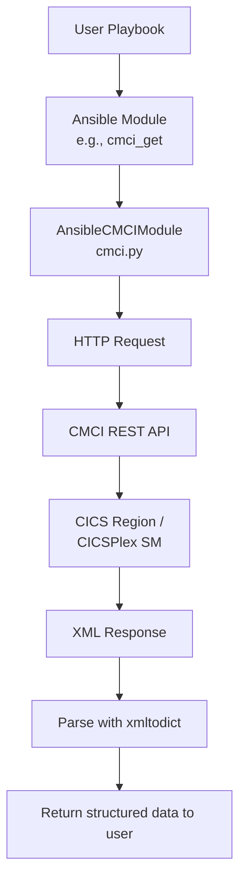
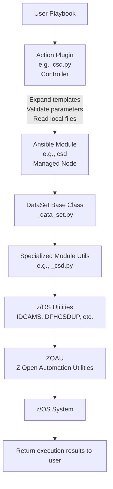

# IBM z/OS CICS Collection Architecture

## Overview

The **IBM z/OS CICS collection** (`ibm.ibm_zos_cics`) is an Ansible collection that provides automation capabilities for managing CICS (Customer Information Control System) resources and regions on IBM z/OS. The collection supports two primary use cases:

1. **CICS Resource Management** - Managing CICS resources through the CMCI REST API
2. **CICS Region Provisioning** - Provisioning and managing standalone CICS regions

## Collection Structure

```
ibm_zos_cics/
├── plugins/
│   ├── modules/           # Ansible modules (user-facing)
│   ├── module_utils/      # Shared utility code
│   ├── action/            # Action plugins for module execution
│   ├── doc_fragments/     # Reusable documentation
│   └── plugin_utils/      # Plugin utilities
├── docs/                  # Documentation
├── tests/                 # Integration and unit tests
└── meta/                  # Collection metadata
```

## Architecture Components

### 1. Module Categories

The collection's modules are organized into two main categories:

#### A. CMCI Modules (Resource Management)

These modules interact with the CICS Management Client Interface (CMCI) REST API to manage CICS resources:

- [`cmci_get`](plugins/modules/cmci_get.py) - Query CICS resources and definitions
- [`cmci_create`](plugins/modules/cmci_create.py) - Create new CICS resources and definitions
- [`cmci_update`](plugins/modules/cmci_update.py) - Update existing CICS resources and definitions
- [`cmci_delete`](plugins/modules/cmci_delete.py) - Delete CICS resources and definitions
- [`cmci_action`](plugins/modules/cmci_action.py) - Perform actions on CICS resources (e.g., NEWCOPY, INSTALL)

**Key Characteristics:**
- Use HTTP/HTTPS to communicate with CMCI
- Support both basic authentication and certificate-based authentication
- Work with CICSPlex SM or standalone SMSS regions
- Return structured data about CICS resources

#### B. Provisioning Modules (Region Management)

These modules manage CICS region data sets and lifecycle:

**Data Set Management:**
- [`csd`](plugins/modules/csd.py) - CICS System Definition (CSD) data set
- [`local_catalog`](plugins/modules/local_catalog.py) - Local catalog data set
- [`global_catalog`](plugins/modules/global_catalog.py) - Global catalog data set
- [`aux_temp_storage`](plugins/modules/aux_temp_storage.py) - Auxiliary temporary storage
- [`aux_trace`](plugins/modules/aux_trace.py) - Auxiliary trace data sets
- [`local_request_queue`](plugins/modules/local_request_queue.py) - Local request queue
- [`td_intrapartition`](plugins/modules/td_intrapartition.py) - Transient data intrapartition
- [`transaction_dump`](plugins/modules/transaction_dump.py) - Transaction dump data sets

**Region Lifecycle:**
- [`region_jcl`](plugins/modules/region_jcl.py) - Generate CICS startup JCL
- [`stop_region`](plugins/modules/stop_region.py) - Stop a running CICS region

**Key Characteristics:**
- Create, initialize, and manage VSAM and sequential data sets
- Support templated data set naming conventions
- Provide state management (absent, initial, warm)
- Execute z/OS utilities (IDCAMS, DFHCSDUP, DFHCCUTL, etc.)

### 2. Module Utilities Layer

The [`module_utils`](plugins/module_utils/) directory contains shared code used by multiple modules:

#### Core Utilities

- [`cmci.py`](plugins/module_utils/cmci.py) - Base class for all CMCI modules
  - Handles HTTP communication with CMCI REST API
  - Manages authentication (basic and certificate)
  - Parses XML responses using xmltodict
  - Provides filter and parameter handling
  - Validates CMCI responses and error handling

- [`_data_set.py`](plugins/module_utils/_data_set.py) - Base class for data set modules
  - Common data set operations (create, delete, initialize)
  - State management (absent, initial, warm)
  - Parameter validation using BetterArgParser
  - VSAM and sequential data set handling

#### Specialized Utilities

- [`_data_set_utils.py`](plugins/module_utils/_data_set_utils.py) - Data set operations
  - IDCAMS command building and execution
  - LISTDS operations for data set inspection
  - IEFBR14 for sequential data set creation

- [`_csd.py`](plugins/module_utils/_csd.py) - CSD-specific operations
  - DFHCSDUP command execution
  - CSD initialization scripts

- [`_local_catalog.py`](plugins/module_utils/_local_catalog.py) - Local catalog operations
  - DFHCCUTL utility execution

- [`_global_catalog.py`](plugins/module_utils/_global_catalog.py) - Global catalog operations
  - DFHRMUTL utility execution

- [`_jcl_helper.py`](plugins/module_utils/_jcl_helper.py) - JCL generation
  - Builds CICS startup JCL
  - Handles DD statements and parameters
  - Manages SIT (System Initialization Table) parameters

- [`_icetool.py`](plugins/module_utils/_icetool.py) - ICETOOL operations
  - Record counting for VSAM data sets

- [`_response.py`](plugins/module_utils/_response.py) - Response handling
  - Execution result structures
  - Exception handling

- [`_zoau_version_checker.py`](plugins/module_utils/_zoau_version_checker.py) - ZOAU validation
  - Ensures compatible ZOAU version is installed

### 3. Action Plugins

Action plugins in [`plugins/action/`](plugins/action/) provide custom execution logic for specific modules:
The collection includes 10 action plugins for provisioning modules. **CMCI modules do not have custom action plugins** but support `module_defaults` via action_groups defined in `meta/runtime.yml`.

**Data Set Action Plugins** (8 plugins extending `_DataSetActionPlugin`):
- [`aux_temp_storage.py`](plugins/action/aux_temp_storage.py), [`aux_trace.py`](plugins/action/aux_trace.py), [`csd.py`](plugins/action/csd.py), [`global_catalog.py`](plugins/action/global_catalog.py), [`local_catalog.py`](plugins/action/local_catalog.py), [`local_request_queue.py`](plugins/action/local_request_queue.py), [`td_intrapartition.py`](plugins/action/td_intrapartition.py), [`transaction_dump.py`](plugins/action/transaction_dump.py)
- Run on controller to expand templated data set names (e.g., `<< data_set_name >>` → `DFHCSD`)
- Validate parameters and resolve library references before sending to modules
- `csd.py` reads local DFHCSDUP scripts; `aux_trace.py` and `transaction_dump.py` select A/B destinations

**Region JCL Action Plugin**:
- [`region_jcl.py`](plugins/action/region_jcl.py) - Processes all region data sets and library templates for JCL generation

**Stop Region Action Plugin**:
- [`stop_region.py`](plugins/action/stop_region.py) - Orchestrates multi-step CICS shutdown with job status polling

### 4. Documentation Fragments

Reusable documentation in [`plugins/doc_fragments/`](plugins/doc_fragments/) provides consistent parameter documentation across related modules:

- `cmci.py` - Common CMCI parameters (host, port, authentication)
- `csd.py` - CSD module parameters
- `local_catalog.py` - Local catalog parameters
- `region_jcl.py` - Region JCL parameters
- And others for each data set type

## Data Flow Architecture

### CMCI Module Flow



### Provisioning Module Flow



## Key Design Patterns

### 1. Inheritance Hierarchy

**CMCI Modules:**
```
AnsibleCMCIModule (base)
    ├── AnsibleCMCIGetModule
    ├── AnsibleCMCICreateModule
    ├── AnsibleCMCIUpdateModule
    ├── AnsibleCMCIDeleteModule
    └── AnsibleCMCIInstallModule (cmci_action)
```

**Data Set Modules:**
```
DataSet (base)
    ├── AnsibleCSDModule
    ├── AnsibleLocalCatalogModule
    ├── AnsibleGlobalCatalogModule
    ├── AnsibleAuxiliaryTempModule
    ├── AnsibleAuxiliaryTraceModule
    ├── AnsibleLocalRequestQueueModule
    ├── AnsibleTDIntraModule
    └── AnsibleTransactionDumpModule
```

### 2. State Management

Data set modules implement a state-based approach:

- **`absent`** - Ensure data set does not exist (delete if present)
- **`initial`** - Create new or reinitialize existing data set (empty)
- **`warm`** - Ensure data set exists with current content preserved
- **`cold`** - Cold start the global catalog (global_catalog only)
- **`changed`** - Apply changes to existing data set (csd only)

### 3. Template-Based Configuration

Modules support templated data set names for consistency:

```yaml
region_data_sets:
  template: "REGIONS.ABCD0001.<< data_set_name >>"
```

This expands to:
- `REGIONS.ABCD0001.DFHCSD`
- `REGIONS.ABCD0001.DFHLCD`
- `REGIONS.ABCD0001.DFHTEMP`
- etc.

### 4. Execution Tracking

All modules track execution details:

```python
executions = [
    {
        "name": "Create data set",
        "rc": 0,
        "stdout": "...",
        "stderr": ""
    }
]
```

This provides transparency and debugging capability.

## Dependencies

### External Dependencies

1. **ZOAU (Z Open Automation Utilities)** - Required for provisioning modules
   - Provides Python APIs for z/OS operations
   - Minimum version checked at runtime

2. **xmltodict** - Required for CMCI modules
   - Parses XML responses from CMCI REST API

3. **ibm.ibm_zos_core** - Ansible collection dependency. Required for provisioning modules
   - Provides core z/OS functionality
   - Used for data set operations, job management, TSO commands

### z/OS Requirements

**For CMCI Modules:**
- CMCI REST API enabled in CICSPlex SM or SMSS
- Network connectivity to CMCI host
- Valid credentials or certificates

**For Provisioning Modules:**
- ZOAU installed on managed node
- CICS libraries (SDFHLOAD, etc.)
- Language Environment libraries
- Appropriate z/OS authorizations

## Error Handling

### CMCI Modules

- HTTP errors are caught and reported with status codes
- CMCI response codes are validated against expected values
- Feedback records provide detailed error information
- XML parsing errors are handled gracefully

### Provisioning Modules

- MVSExecutionException wraps z/OS utility failures
- Return codes from utilities are checked
- Execution history is preserved for debugging
- Data set state is validated before operations

## Security Considerations

### Authentication

**CMCI Modules:**
- Support basic authentication (username/password)
- Support certificate-based authentication (cert/key)
- Credentials can be provided via environment variables
- Passwords and certificates are marked as `no_log`

**Provisioning Modules:**
- Rely on SSH authentication to managed node
- Execute with user's z/OS credentials
- Require appropriate data set and utility authorizations

## Performance Considerations

### CMCI Modules

- Single HTTP request per module invocation
- Configurable timeout (default 30 seconds)
- Support for filtering to reduce data transfer
- Connection reuse within session

### Provisioning Modules

- Data set operations can be time-consuming
- Large data sets may require significant space
- VSAM operations are synchronous
- Multiple modules can run in parallel (different data sets)

## Extensibility

### Adding New CMCI Modules

1. Extend `AnsibleCMCIModule` base class
2. Implement required methods:
   - `init_argument_spec()` - Define parameters
   - `init_body()` - Build request body (if needed)
   - `init_request_params()` - Build URL parameters

### Adding New Data Set Modules

1. Extend `DataSet` base class
2. Implement required methods:
   - `_get_arg_spec()` - Define parameters
   - `create_data_set()` - Data set creation logic
   - `execute_target_state()` - State-specific logic (optional)
3. Create corresponding module_utils helper (e.g., `_new_dataset.py`)

## Testing Strategy

### Integration Tests

Located in [`tests/integration/targets/`](tests/integration/):
- Test against real CICS regions
- Validate end-to-end workflows
- Cover error scenarios

### Unit Tests

Located in [`tests/unit/`](tests/unit/):
- Test individual functions and classes
- Mock external dependencies
- Validate parameter parsing and validation

## Version Compatibility

- **Ansible**: Requires >= 2.15.0
- **Python**: Compatible with Python 3.6+
- **CICS**: Supports CICS TS 5.6 and later
- **z/OS**: Tested on z/OS 2.4 and later
- **ZOAU**: Version checked at runtime
